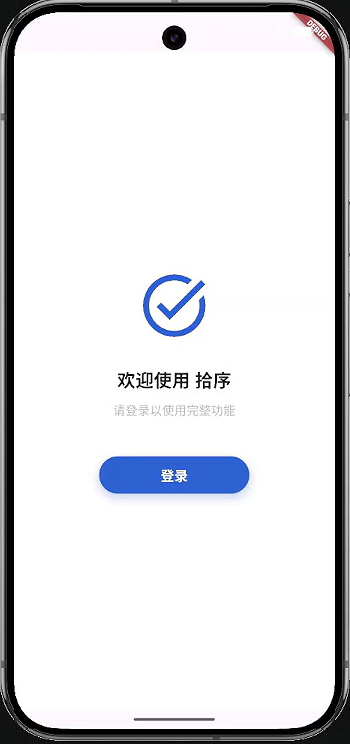
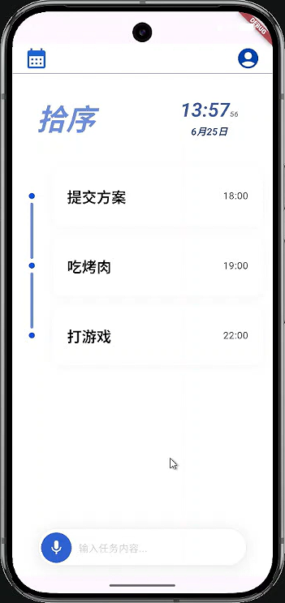

<a id="readme-top"></a>
# 拾序（Reminder）

<div align="center">
  <p style="color: #2F63D0; font-size: 24px; font-weight: bold;">任务管理-agent应用</p>
  
  
</div>

---

##  关于项目

该应用用于管理个人日常任务，包括任务的创建、删除、修改等操作。
用户可直接使用自然语言指令进行交互，方便地管理自己的任务，梳理任务列表。
> 本项目由个人开发，是学习agent过程中的实践，仅在模拟器上进行开发测试，未在真实设备上进行生产环境测验。
> 
> 点击[此链接](./assets/demo_reminder.mp4?raw=true)下载查看demo视频。

<a href="./assets/demo_reminder.mp4" download="demo_reminder.mp4">查看demo视频</a>

### 技术栈

- **前端**：Flutter, Android
- **后端**：FastAPI, sqlite
- **agent**：ReAct

### 功能描述

- [x] **自然语言交互**：用户可通过自然语言指令与应用进行交互，无需创建任务的复杂的操作流程。
- [ ] **语音输入**：用户通过语音指令与应用进行交互。
    - [x] 语音流式输入。
    - [ ] 语音识别能力优化。
- [ ] **任务管理**：agent对用户任务列表进行管理。
  - [x] agent处理单次任务中的复杂指令（创建、修改、删除、规划）。
  - [ ] agent可从全局角度对任务列表进行梳理优化，帮助用户更高效地管理任务。

---

##  运行依赖

### 后端启动
1. 前置要求

    从[huggingface](https://huggingface.co/csukuangfj/sherpa-onnx-streaming-zipformer-bilingual-zh-en-2023-02-20/tree/main)将以下文件下载并保存至/backend/assets/zipformer中。

       - `decoder-epoch-99-avg-1.onnx`
       - `encoder-epoch-99-avg-1.onnx`
       - `joiner-epoch-99-avg-1.onnx`
       - `tokens.txt`

2. 后端环境

    依次执行以下命令，创建环境并启动后端服务

    ```bash
    conda create -n reminder python=3.13
    conda activate reminder
    pip install -r backend/requirements.txt
    uvicorn backend/main:app --host 0.0.0.0 --port 8000
    ```

### 前端启动
1. 安装依赖

   配置`dart`、`flutter`相关环境。

2. 启动应用

   开发阶段使用的模拟器是通过Android studio创建的`pixel 9 pro`。

   请自行配置模拟器以启动应用。

<p align="right">(<a href="#readme-top">back to top</a>)</p>